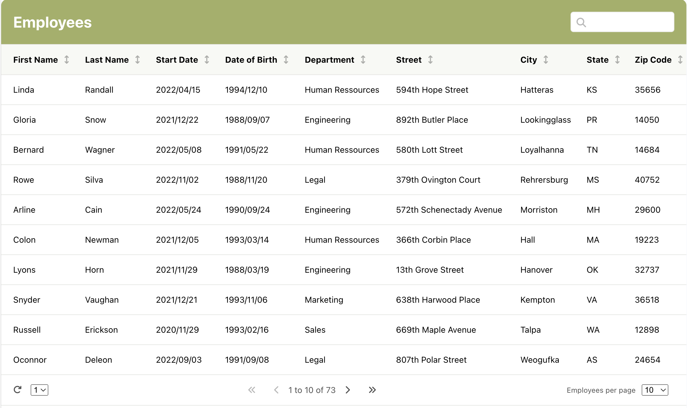

# Easy-react-table-component

 

An easy-to-use and customizable React table component.

## Installation

- Installation via npm :
  `npm install easy-react-table-component`

- Import in a React file :
  `import Table from 'easy-react-table-component';`

## Requirements

To display icons you need to install Font Awesome.

1. Got to [Font Awesome](https://fontawesome.com/)

2. Create and install your Free [kit](https://fontawesome.com/kits) in your HTML head

## Props

| Name          | Type    | Description                                                                                                                                                                   | Example                                                                                                                                                                                                                  |
| ------------- | ------- | ----------------------------------------------------------------------------------------------------------------------------------------------------------------------------- | ------------------------------------------------------------------------------------------------------------------------------------------------------------------------------------------------------------------------ |
| data          | JSON    | The JSON data that will be displayed in the table. The data will be flattened to be displayed in the table.                                                                   | [{firstName: "Linda", lastName: "Randall", startDate: "2022/04/15", address: { street: "594th Hope Street", city: "Hatteras", state: "KS", zipCode: "35656" }, birthDate: "1994/12/10", department: "Human Ressources"}] |
| listToDisplay | JSON    | "JSON file specifying the elements of the JSON data to be displayed in the table. "dataName" represents the name of the data, and "displayData" represents the column title." | [{ dataName: "firstName", displayName: "First Name" }]                                                                                                                                                                   |
| tableTitle    | String  |                                                                                                                                                                               |                                                                                                                                                                                                                          |
| researchBar   | Boolean | Cellule 6                                                                                                                                                                     |
| rowPagination | Number  | Cellule 6                                                                                                                                                                     |
| labelPerPage  | String  | Cellule 6                                                                                                                                                                     |

## Styling

## Repository

`https://github.com/JohanHauteville/react-table-component`

## Changelog

- ver 1.0.2 : Fix React import
- ver 1.0.4 : Fix Table Length
- ver 1.0.5 : Fix research Bar error when there's no data
- ver 1.0.6 : Add Ramda Librairie to flatten data
- ver 1.0.7 : Fix error on flatten data
- ver 1.0.8 : Fix flatten data with mergeAll
- ver 1.0.9 : Fix error on empty data
- ver 1.1.0 : Update responsivity

Thanks for your support !
